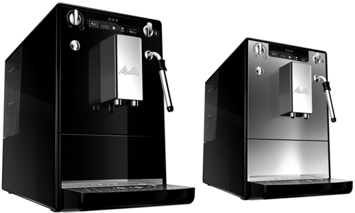
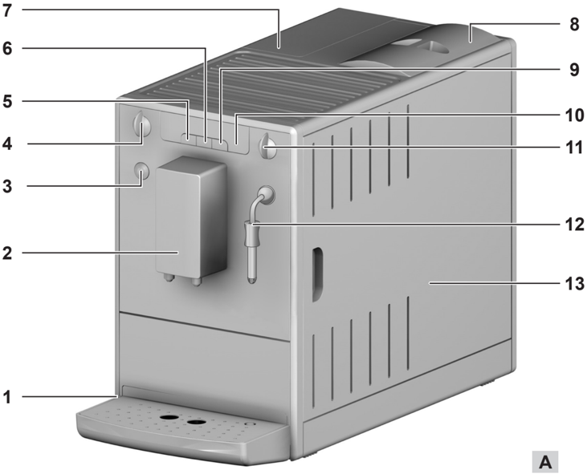
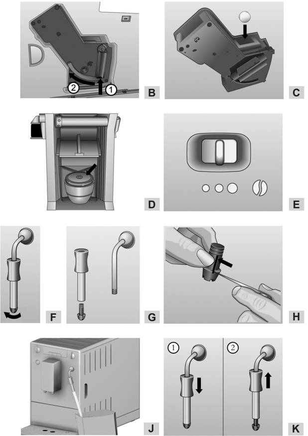
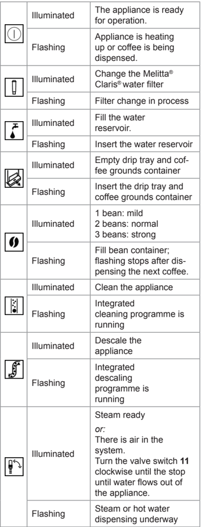
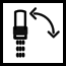
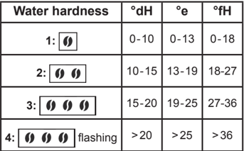
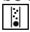
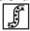
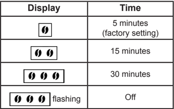
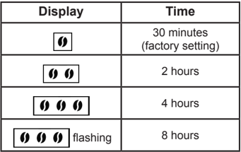

## SOLO&amp; milk

## Safety instructions

Please carefully read and comply with the operating instructions.

The appliance is intended for home use only and not for commercial purposes.

Any other use is regarded as improper and may lead to personal injury and material damage. Melitta ® accepts no liability for damage which arises due to improper use of the appliance.

The appliance conforms to the following European directives:

- -2014 / 35 / EU (low voltage),
- -2014 / 30 / EU (electromagnetic compatibility),
- -2011 / 65 / EU (RoHS),
- -2009 / 125 / EC (eco-design / ErP).

The appliance has been built using the latest technology. Residual dangers nevertheless exist.

You must observe the safety instructions to avoid dangers. Melitta ® accepts no liability for damage caused by failure to observe the safety instructions.

## Danger due to electrical current

If the appliance or the power cable is damaged, the risk of a fatal electric shock is run.

Observe the following safety instructions to avoid dangers due to electrical current:

- -Do not use a damaged power cable.
- -A damaged power cable may only be replaced by the manufacturer, its customer service or a similarly qualified person.
- -Do not open any covers firmly screwed onto the appliance housing.
- -Only use the appliance when it is in a technically flawless condition.
- -A defective appliance may only be repaired by an authorised workshop. Do not repair the appliance yourself.
- -Do not undertake any changes to the appliance, its components or its accessories.
- -Do not immerse the appliance in water.

## Warning!

## Risk of burning and scalding

Escaping fluids and steam may be very hot. Parts of the appliance also become very hot.

Observe the following safety instructions to avoid scalds and burns:

- -Prevent skin from coming into contact with escaping fluids and steam.
- -Do not touch any nozzles on the outlet during operation.

## Warning!

## General safety

Observe the following safety instructions to avoid personal injury and material damage:

- -Do not reach into the interior of the appliance during operation.
- -The appliance and its power cable must be kept out of the reach of children under 8 years of age.
- -This appliance may be used by children over 8 years of age and by persons with reduced physical, sensory or mental capabilities or a lack of experience and knowledge if they are supervised or have been instructed in using the appliance safely and understand the resulting risks.
- -Children must not play with the appliance. Cleaning and maintenance must not be undertaken by children younger than 8 years of age. Children over 8 years of age must be supervised during cleaning and maintenance.
- -Disconnect the appliance from the power supply when it is left unsupervised for a long time.

## At a glance

## Figure A

|   1 | Drip tray with cup plate and coffee grounds container as well as display for full drip tray                       |
|-----|-------------------------------------------------------------------------------------------------------------------|
|   2 | Height-adjustable outlet                                                                                          |
|   3 | ON/OFF button                                                                                                     |
|   4 | Coffee quantity regulator                                                                                         |
|   5 | Button for coffee dispensing                                                                                      |
|   6 | Button for coffee strength                                                                                        |
|   7 | Water reservoir                                                                                                   |
|   8 | Bean container                                                                                                    |
|   9 | Button for steam dispensing                                                                                       |
|  10 | Display                                                                                                           |
|  11 | Valve for steam and hot water dispensing                                                                          |
|  12 | steam pipe                                                                                                        |
|  13 | Right cover (removable, covering the grinding fineness adjustment element, brewing unit and identification label) |

## Display

| Icon | State | Description |
|:----:|-------|-------------|
|  | Illuminated | The appliance is ready for operation. |
|  | Flashing | Appliance is heating up or coffee is being dispensed. |
|  | Illuminated | Change the Melitta® Claris® water filter |
|  | Flashing | Filter change in process |
|  | Illuminated | Fill the water reservoir. |
|  | Flashing | Insert the water reservoir |
|  | Illuminated | Empty drip tray and coffee grounds container |
|  | Flashing | Insert the drip tray and coffee grounds container |
|  | Illuminated | 1 bean: mild, 2 beans: normal, 3 beans: strong |
|  | Flashing | Fill bean container; flashing stops after dispensing the next coffee. |
|  | Flashing | Clean the appliance |
|  | Illuminated | Integrated cleaning programme is running |
|  | Flashing | Descale the appliance |
|  | Illuminated | Integrated descaling programme is running |
|  | Illuminated | Steam ready or: There is air in the system. Turn the valve switch 11 clockwise until the stop until water flows out of the appliance. |
|  | Flashing | Steam or hot water dispensing underway |

## Before using for the first time

## General information

-  Only use pure water without carbonation.
-  Use the supplied test strip to determine the hardness of the water used and set the water hardness ("Water hardness and filter", page 22).

## Information for using for the first time

The appliance must be vented before it is used for the first time. To do so, the appliance may only be switched on without a Melitta ®  Claris ® water filter and with a completely filled water reservoir.

-  Place a vessel under the steam pipe 12 .
-  Press the button to switch on the appliance.  illuminates on the display.
-  Turn the valve switch 11 clockwise until the stop.  flashes on the display. Water will flow into the vessel.
-  When  is illuminated on the display, turn the valve switch 11 counterclockwise until the stop.
-  The appliance is ready for operation.
- After using the appliance for the first time, insert the Melitta ®  Claris ®  water filter if required (see page 23).

EN

## Starting up the appliance

## Starting up

## Warning!

Danger of fire and electric shock due to incorrect supply voltage, incorrect or damaged connections and power cable.

- -Ensure that the supply voltage corresponds to the supply voltage specified on the identification label of the appliance. The identification label is located on the right side of the appliance behind the cover (Image A , 13 ).
- -Make sure that the power socket meets the applicable standards for electrical safety. If in doubt, contact a qualified electrician.
- -Never use damaged power cables (damaged insulation, bare wires).
-  Place the appliance on a stable, dry and level surface with sufficient clearance (at least 10 cm) to the sides.
-  Plug the power cable into a suitable power socket.
-  Remove the lid from the bean container 8 .
-  Fill the bean container with suitable coffee beans.
-  Put the lid back on.
-  Lift up the lid of the water reservoir 7 and pull the water reservoir up and out of the appliance.
-  Fill the water reservoir with fresh tap water only up to the max. mark.
-  Insert the water reservoir into the appliance.
-  Place a vessel under outlet 2 .
-  Press the ON/OFF button to switch the appliance on or off. The appliance performs an automatic rinse if necessary.

## Preparation

-  Fill the water reservoir with fresh water every day. The water reservoir must always be filled with enough water for the operation of the appliance.
-  Fill the bean container preferably with espresso beans or bean mixtures for fully automatic coffee machines. Do not use any ground, glazed, caramelised or otherwise sugar-coated coffee beans.

## Setting the dispensed quantity and strength

-  Turn the coffee quantity regulator 4 to infinitely adjust the dispensed quantity.
- Regulator all the way to the left = 30 ml per cup Regulator all the way to the right = 220

ml per cup

-  Press the button until the desired strength is adjusted. The strength is shown by the beans on the display 10 (from = mild to = strong).

## Dispensing coffee or espresso

One or two cups can be dispensed simultaneously.

-  Switch on the appliance.
-  Place one or two cups under the outlet.
- Preparing one cup: Press the button once
- Preparing two cups: Press the button twice .
-  Press the button again to cancel the coffee dispensing.

## Preparing milk froth and heating milk and water

## Warning!

There is a risk of burn injuries and scalding due hot steam and the hot steam pipe.

- -Never reach into the escaping steam.
- -Avoid direct skin contact with hot water and the hot steam pipe.
- -Never touch the steam pipe during use or immediately after use.

The steam pipe is used to prepare milk froth, to heat milk or to dispense hot water.

## Preparing milk froth

If possible, use cold milk with a high protein content.

-  Switch on the appliance.
-  Push the outer shell of the steam pipe down in the direction shown by the arrow (Image K, 1 ).
-  Press the button.  flashes while the appliance is heating up. After the heat-up phase,  is illuminated.
-  Fill the vessel with milk to maximum one third.
-  Hold the vessel under the steam pipe. In doing so, ensure that the tip of the steam pipe is immersed in the milk.
-  Turn the valve switch 11 clockwise until the stop.  is flashing. The hot steam froths the milk and heats it up.
-  Turn the valve switch 11 counterclockwise until the stop. The frothing is completed.
-  Rinse the steam pipe after each use.

## Heating milk

-  Switch on the appliance.
-  Push the outer shell of the steam pipe up in the direction shown by the arrow (Image K, 2 ).
-  Fill a vessel with milk.
-  Hold the vessel under the steam pipe. In doing so, ensure that the tip of the steam pipe is immersed in the milk.
-  Press the button.  flashes while the appliance is heating up. After the heat-up phase,  is illuminated.
-  Turn the valve switch 11 clockwise until the stop.  is flashing. The hot steam heats up the milk.
-  Turn the valve switch 11 counterclockwise until the stop. The heating is completed.
-  Rinse the steam pipe after each use.

## Rinsing the steam pipe

The steam pipe should be cleaned at regular intervals ("Cleaning the steam pipe", page 23).

-  Switch on the appliance.
-  Fill a vessel halfway with clear water.
-  Hold the vessel under the steam pipe. In doing so, ensure that the tip of the steam pipe is immersed in the water.
-  Press the button.  flashes while the appliance is heating up. After the heat-up phase,  is illuminated.
-  Turn the valve switch 11 clockwise until the stop. Close the valve again after 5 seconds. The steam pipe has been rinsed.
-  Wait for 30 seconds or press the button to change to the normal operating mode.

## Dispensing hot water

A maximum of 150 ml of hot water can be dispensed in each process. To dispense a larger amount of hot water, repeat the process.

-  Switch on the appliance.
-  Push the outer shell of the steam pipe up in the direction shown by the arrow (Image K, 2 ).
-  Hold the vessel under the steam pipe.
-  Turn the valve switch 11 clockwise until the stop.  is flashing. Hot water will flow into the vessel.
-  Turn the valve switch 11 counterclockwise until the stop.

## Water hardness and filter

It is important to properly set the water hardness so that the appliance displays the need to be descaled in due time. From the factory, it is set at water hardness 4.

After inserting a Melitta ®  Claris ®  water filter, it is automatically set at hardness level 1.

## Melitta ® Claris ® water filter

The Melitta ® Claris ® water filter removes lime and other harmful substances from the water. The water filter should be changed every 2 months, however, at the latest when  appears on the display. The water filter is available in specialised shops.

## Inserting the water filter

 flashes during the entire changing process.

- Put the water filter in a glass with tap water for several minutes before inserting it in the appliance.
-  Switch off the appliance.
-  Press and hold the  and  buttons for approx. 3 seconds, then release.  appears on the display.
-  Empty the drip tray and insert without the coffee grounds container.  illuminates.
-  Pull the water reservoir 7 up and out of the appliance.
-  Empty the water reservoir.
- Screw the water filter onto the thread at the bottom of the water reservoir.
-  Fill the water reservoir with fresh tap water up to the max. mark.
-  Insert the water reservoir into the appliance.  illuminates.
-  Place the coffee grounds container under the steam pipe 12 .
-  Turn the valve switch 11 clockwise until the stop.  flashes on the display. Water will flow into the vessel.
-  When  is illuminated on the display, turn the valve switch 11 counterclockwise until the stop.
-  The appliance is ready for operation.  and  illuminate. The water hardness is automatically set to hardness level 1.
-  Empty and insert the coffee grounds container.

After inserting the water filter, the water can be cloudy during the first rinse because excess activated carbon is washed out of the filter. The water will then be clear clear again.

## Setting the water hardness

The appliance includes a test strip to determine the water hardness.

-  Determine the hardness of the tap water using the test strip.
-  Switch on the appliance.
-  Press the  and  buttons simultaneously for longer than 2 seconds.  flashes rapidly.
-  Press the  button to show the menu for setting the water hardness.  illuminates.
-  Set the determined water hardness by pressing the  button. The selected water hardness is shown by the bean symbols .
-  Press  to confirm the selection.

| Water hardness   | °dH   | °e    | °fH   |
|------------------|-------|-------|-------|
| 1:               | 0-10  | 0-13  | 0-18  |
| 2:               | 10-15 | 13-19 | 18-27 |
| 3:               | 15-20 | 19-25 | 27-36 |
| 4: flashing      | >20   | >25   | >36   |

## Cleaning and maintenance

## Warning!

- -Pull the power supply plug before cleaning.
- -Never immerse the appliance in water.
- -Do not use a steam cleaner.

## Daily cleaning

-  Wipe the outside of the appliance with a soft damp cloth and normal dishwashing liquid.
-  Empty the drip tray.
-  Empty the coffee grounds container.

## Cleaning the steam pipe

-  Let the steam pipe cool down.
-  Wipe the steam pipe on the outside with a damp cloth.
-  Twist off the steam pipe in the direction shown by the arrow (Image F ).
-  Pull the nozzle out of the steam pipe (Image G ).
-  Rinse all of the parts thoroughly with water and dishwashing detergent if necessary.
-  Clean the nozzle with a pointed object or a brush (Image H ).
-  Push the nozzle into the steam pipe.
-  Twist on the steam pipe the opposite direction as shown by the arrow (Image F ).

## Cleaning the brewing unit

It is recommended to clean the brewing unit once a week.

-  Switch off the appliance and pull the power supply plug.
-  Pull off the cover 13 to the right.

EN

-  Press and hold the red button on the handle of the brewing unit (Image B, 1 ).
-  Turn the handle clockwise until the stop.
-  Pull the brewing unit out of the appliance by the handle.
-  Rinse the brewing unit thoroughly on all sides with clear water. The area shown in Image D (arrow) must be free of coffee residues.
-  Let the brewing unit drip dry.
-  Remove coffee residues from the appliance.
-  Insert the brewing unit back into the appliance, press and hold the red button (Image B, 1 ) and turn the handle counterclockwise until the stop.
-  Insert the cover until it clicks in.

## Integrated cleaning programme

The integrated cleaning programme (takes about 15 minutes) removes residues and coffee oil residues that cannot be removed by hand. The  cleaning symbol flashes during the entire process.

The cleaning programme should be performed every 2 months or after 200 brewed cups, however, at the latest when  is lit up.

Only use Melitta ®  cleaning tabs.

-  Switch off the appliance.
-  Fill the water reservoir with tap water up to the max. mark.
-  Insert the water reservoir.
-  Press the  and  buttons simultaneously for longer than 2 seconds.  flashes,  illuminates.
-  Empty the drip tray and coffee grounds container.
-  Insert the drip tray without the coffee grounds container
-  Place the coffee grounds container under outlet 2 .

## Cleaning phase 1 ():

Two rinsing processes will be performed. When  illuminates, proceed as follows:

-  Remove and clean the brewing unit ("Cleaning the brewing unit", page 23).
-  Put a cleaning tab in the brewing unit (Image C ).
-  Insert the brewing unit ("Cleaning the brewing unit", page 23).

Cleaning phase 2 ():

When  illuminates, proceed as follows:

-  Fill the water reservoir with tap water up to the max. mark.
-  Press the  button to continue with the cleaning programme (takes about 5 minutes).

Cleaning phase 3 ():

When  illuminates, proceed as follows:

-  Empty the drip tray and coffee grounds container.
-  Insert the drip tray without the coffee grounds container
-  Place the coffee grounds container under outlet 2 .

Cleaning phase 4 (, the middle bean is flashing):

-  The cleaning programme will be continued again and takes about 5 minutes.

When  illuminates, proceed as follows:

-  Empty the drip tray and coffee grounds container and insert them in the appliance as usual.

The cleaning programme is finished.

## Integrated descaling programme

## Warning!

## The descaling agent can cause skin irritations

Comply with the safety instructions and the dosing information specified on the descaling agent packaging.

The integrated descaling programme (takes about 30 minutes) removes lime residues inside the appliance. The  symbol for descaling flashes during the entire process.

The descaling programme should be performed every 3 months, however, at the latest when  illuminates ("Setting the water hardness", page 23).

## Only use Melitta ®  ANTI CALC.

-  Switch off the appliance.
-  Pull the supplied hose approx. 1 cm over the steam pipe (Image J ) to prevent the spraying of liquids.
-  Place the coffee grounds container to the right of the appliance. The hose should protrude into the coffee grounds container as shown in Image J .
- Remove the water filter if necessary ("Water hardness and filter", page 22).
-  Press the  and  buttons simultaneously for ca. 3 seconds.  flashes,  illuminates.

Descaling phase 1 ():

-  Empty and reinsert the drip tray.  illuminates.
-  Completely empty the water reservoir.
-  Add the descaling agent to the water reservoir according to the instructions on the packaging.
-  Insert the water reservoir.
-  Press the  button to start the descaling programme (takes about 15 minutes).

## Descaling phase 2 ():

When  illuminates, proceed as follows:

-  Ensure that the coffee grounds container is placed under the steam pipe with the hose.
-  Turn the valve switch 11 clockwise until the stop.  is flashing. Water will flow intermittently into the coffee grounds container (takes about 10 minutes).  is then illuminated.
-  Empty the drip tray and coffee grounds container.
-  Reinsert the drip tray and put the coffee grounds container back under the steam pipe.  illuminates.
-  Rinse the water reservoir thoroughly with clear water.
-  Fill the water reservoir with tap water up to the max. mark.
-  Insert the water reservoir.
-  Press the  button to continue with the descaling programme.  is flashing. Water flows into the coffee grounds container.

Descaling phase 3 ():

When  illuminates, proceed as follows:

-  Turn the valve switch 11 counterclockwise until the stop. Water flows inside the appliance into the drip tray.
-  When  is illuminated, empty the drip tray and the coffee grounds container and reinsert them. When  is illuminated, the descaling programme is finished.
- Insert the water filter if necessary ("Water hardness and filter", page 22).

EN

## Other settings

## Energy-saving mode

After the last action, the appliance switches automatically (depending on the settings) to the energy-saving mode. The appliance is set to 5 minutes in the factory.

-  Switch on the appliance.
-  Press the  and  buttons simultaneously until  flashes.
-  Press the  button twice.  illuminates.
-  Press the  button until one of the four times is set. The time is displayed by the beans  on display 9.
-  Press the  button to confirm the setting.

| Display | Time |
|:-------:|------|
|  | 5 minutes (factory setting) |
|  | 15 minutes |
|  | 30 minutes |
|  flashing | Off |

## Auto-OFF function

The appliance switches off automatically after the last action (depending on the setting). From the factory, the appliance is set at 30 minutes.

-  Switch on the appliance.
-  Press the  and  buttons simultaneously until  flashes.
-  Press the  button three times.  illuminates.
-  Press the  button until one of the four switch-off times is set. The time is displayed by the beans  on display 9.
-  Press the  button to confirm the setting.

| Display | Time |
|:-------:|------|
|  | 30 minutes (factory setting) |
|  | 2 hours |
|  | 4 hours |
|  flashing | 8 hours |

## Brewing temperature

The brewing temperature is factory-set at level 2 (medium).

-  Switch on the appliance.
-  Press the  and  buttons simultaneously until  flashes.
-  Press the  button four times.  illuminates.
-  Press the  button, until one of the three brewing temperatures is set. The temperature is shown by the beans  on display 9 (from low to high).
-  Press the  button to confirm the setting.

## Adjusting the grinding fineness

The grinding fineness was set before the appliance was delivered. We therefore recommend to only adjust the grinding fineness after about 1 000 coffee preparations (about 1 year).

The grinding fineness should only be adjusted immediately after starting coffee dispensing and only while the mill is running.

-  Pull off the cover 13 to the right.
-  Start dispensing coffee
-  Put the lever (Image E ) in a desired position (left = fine to right = coarse).
-  Insert the cover and swivel to the left until it clicks in.

## Transport, Storage and Disposal

## Venting

## Warning!

There is a risk of burn injuries and scalding due hot steam and the hot steam pipe.

- -Never touch the steam pipe during use or immediately after use.

The appliance should be vented when it has not been used for a while or has been transported. The appliance is then protected from frost damage.

- Remove the water filter if necessary ("Water hardness and filter", page 22) and keep it cool in a glass filled with tap water.
-  Switch on the appliance.
-  Press the  and  buttons simultaneously for approx. 2 seconds.  flashes, and then  illuminates.
-  Pull the water reservoir 7 up and out of the appliance.  illuminates.
-  Place a vessel under the steam pipe 12 .
-  Turn the valve switch 11 clockwise until the stop.  is flashing. Water flows out of the steam pipe and into the vessel; steam will also escape.
-  When there is no more steam escaping: Turn the valve switch 11 counterclockwise until the stop.
-  Insert the water reservoir into the appliance.

## Transport

-  Vent the appliance.
-  Empty and clean the drip tray and coffee grounds container.
-  Empty the water reservoir and th bean container. If necessary, vacuum out beans that are stuck at the bottom.
-  "Cleaning the brewing unit", page 23.
-  If possible, transport the appliance in the original packaging including the hard foam elements.

## Disposal

This appliance is labelled according to the European Directive 2002/96/EC on waste electrical and electronic equipment (WEEE). The Directive prescribes the framework for a EU-wide applicable return and recycling of waste appliances. Please contact a specialised dealer for current disposal procedures.

| Troubleshooting                                                | Troubleshooting                                               | Troubleshooting                                                                                                                                                                                                                |
|----------------------------------------------------------------|---------------------------------------------------------------|--------------------------------------------------------------------------------------------------------------------------------------------------------------------------------------------------------------------------------|
| Fault                                                          | Cause                                                         | Measure                                                                                                                                                                                                                        |
| Coffee only flows drop-by- drop.                               | Grinding fineness is too fine.                                | Adjust the grinding fineness more coarse. Clean the brewing unit. Perform a descaling or cleaning programme if necessary.                                                                                                      |
| Coffee does not flow.                                          | Water tank not filled or incorrectly inserted.                | Fill the water tank and make sure it is inserted correctly.                                                                                                                                                                    |
| Coffee does not flow.                                          | Brewing unit is obstructed.                                   | Clean the brewing unit.                                                                                                                                                                                                        |
| The grinder is not grinding.                                   | The beans are not falling into the grinder.                   | Tap lightly on the bean container.                                                                                                                                                                                             |
| The grinder is not grinding.                                   | Foreign objects in the grinder.                               | Call the hotline.                                                                                                                                                                                                              |
| Loud grinder noise                                             | Foreign objects in the grinder.                               | Call the hotline.                                                                                                                                                                                                              |
|  Bean symbols are flashing although the bean container is full. | Insufficient quantity of ground beans in the brewing chamber  | Press the  button or  button.                                                                                                                                                                                                    |
| The  symbol is illuminated without a reason.                    | There is air in the lines inside the appliance.               | Turn the valve switch 11 clockwise until the stop until water flows out of the appliance. Clean the brewing unit if necessary.                                                                                                 |
| The cleaning or descaling process was interrupted.             | The power supply was interrupted, e.g. due to a power outage. | The appliance performs a rinsing program autonomously. To do so, follow the instructions on the appliance.                                                                                                                     |
| Not enough milk froth is formed during the frothing process.   | The nozzle of the steam pipe is in the wrong position.        | Adjust to the proper position.                                                                                                                                                                                                 |
| Not enough milk froth is formed during the frothing process.   | The steam pipe nozzle is dirty.                               | Clean the nozzle.                                                                                                                                                                                                              |
| The brewing unit can no longer be reinserted after removal.    | The brewing unit is not properly locked.                      | Check whether the handle for locking the brewing unit is correctly engaged.                                                                                                                                                    |
| The brewing unit can no longer be reinserted after removal.    | The actuator is not in the proper position.                   | Switch the appliance off and then on again. Press the  and  buttons simultaneously for longer than 2 seconds. The actuator is put into position. Then reinsert the brewing unit and make sure it is correctly locked into place. |
| The symbols for cleaning and stand-by flash alternately.       | The brewing unit is missing or not properly inserted.         | Insert the brewing unit properly.                                                                                                                                                                                              |
| The symbols for cleaning and stand-by flash alternately.       | The brewing chamber is overfilled.                            | Switch off the appliance and switch it on again using the ON/OFF button (repeat if necessary) until standby mode is displayed.                                                                                                 |
| Continuous flashing of all buttons                             | System error                                                  | Switch off the appliance and switch it on again via the ON/OFF button ; if this does not solve the problem send the appliance to the service department.                                                                       |

## EN - Guarantee Conditions

In addition to the end consumer's statutory guarantee rights in relation to the seller; for new appliances bought after 01 September 2013 from a dealer authorized due to his expertise by Melitta, we give a manufacturer's guarantee based on the following conditions:

1.  The guarantee period begins with the day the product was sold to the end user. The guarantee period is 24 months. The purchase date of the device must be verified by a purchase receipt.

The device was designed and built for use in private households. For fully automatic machines, from a number in excess of 7,500 brewing processes a year we assume commercial use. Commercial use includes using the appliance to make coffee for customers in offices, workshops, law offices etc. In this case, the guarantee period is 12 months or 15,000 brewing processes, whichever occurs first.

Guarantee performances lead neither to an extension of the guarantee period nor to a new beginning of the guarantee period for the device or installed spare parts.

2.  Within the guarantee period we will correct all device defects that are based on material or manufacturing errors, through repair or replacement of the device, at our discretion. Replaced parts become the property of Melitta. If meanwhile components were revised or software was updated, actualisations of repaired parts and/or software is permitted unless not waived by the customer in writing before the repair (order). 3.  Defects that occurred due to improper connection, improper handling, or repair attempts by non-authorized persons are not covered by the guarantee. The same applies for failure to comply with the use, care, and maintenance (e.g. calcification) instructions as well for the use of consumables (e.g. cleaning and decalcifying agents or water filters) that do not correspond to the original specifications. Wear parts (e.g. seals and valves), fragile parts like glass, and damage caused by foreign objects in the grinder (e.g. stones) are excluded from the guarantee. 4.  Guarantee performances are processed via the Service

Hotline for the respective country.

5.  These guarantee conditions apply for appliances purchased and used in Germany, Austria, Switzerland, Denmark, France, The United Kingdom, Spain, The Netherlands and Belgium. If an appliance is purchased abroad or taken abroad, then guarantee benefits will only be provided as specified in the guarantee conditions applicable to that country.

## GB - Contact

Melitta International GmbH - UK Division 32 A Thorpe Wood Business Park Thorpe Wood Peterborough PE3 6SR United Kingdom www.international.melitta.de

(+44) 0800 0288002 monday - friday 8 am - 5 pm toll free

Version 4.0 09/2016 1234-0816

Melitta Europa GmbH &amp; Co. KG D-32372 Minden